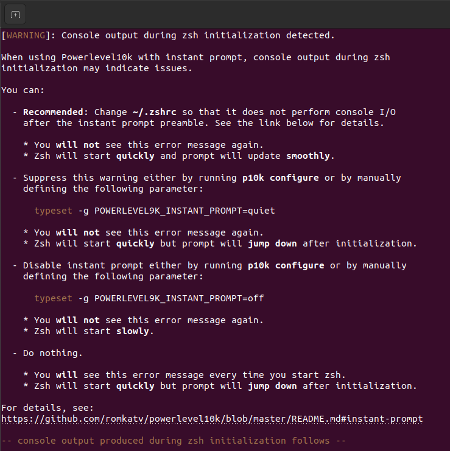

# <center>Ubuntu 22.04.1 LTS</center>

### TODO
- Add terminal design
- Add python script

## Notes

· Screen sharing (on Slack):

By default in Ubuntu (22.04/10) it is not possible to share your screen if you
try it, you only will see a black screen with the cursor. To solve this, you must
comment this line on this file:

```bash
sudo nano /etc/gdm3/custom.conf

WaylandEnable=false
```
*If you uncomment this line your touchpad gestures won't work because potatoe*


· If a repo (running sudo apt update) update fails throwing the following message:
```bash
Err:3 http://archive.ubuntu.com/ubuntu jammy-updates InRelease Temporary failure resolving 'archive.ubuntu.com'
```
Run this console command:
```bash
echo "nameserver 8.8.8.8" | sudo tee /etc/resolv.conf > /dev/null
```

It is becase of DNS problem

## 1. Curl
```bash
sudo apt install curl
```

## 2. Pip
```bash
sudo apt install python3-pip
# Necessaery for code
pip3 install mypy
# Recomendation: add to $PATH
PATH=$PATH:$HOME/.local/bin

```

## 3. Heroku
```bash
# Installation
curl https://cli-assets.heroku.com/install.sh | sh
# Checking the installation
heroku --version
```


## 4. Ngrok
Install ngrok
```bash
snap install ngrok
```

Login into a Ngrok account:
```bash
ngrok config add-authtoken [authtoken]
```


## 5. Terminal
### 5.1. Zsh
```bash
# Zsh installation
sudo apt install zsh
# Set zsh as default shell
chsh -s $(which zsh) $USER
# Log out/in to see the results
```

### 5.2. OhMyZsh
```bash
sh -c "$(curl -fsSL https://raw.github.com/ohmyzsh/ohmyzsh/master/tools/install.sh)"
```

### 5.3. Add config to .zshrc
```bash
HISTFILE=“$HOME/.zsh_history”
HISTSIZE=10000000
SAVEHIST=10000000
setopt BANG_HIST                 # Treat the ‘!’ character specially during expansion.
setopt EXTENDED_HISTORY          # Write the history file in the “:start:elapsed;command” format.
setopt INC_APPEND_HISTORY        # Write to the history file immediately, not when the shell exits.
setopt SHARE_HISTORY             # Share history between all sessions.
setopt HIST_EXPIRE_DUPS_FIRST    # Expire duplicate entries first when trimming history.
setopt HIST_IGNORE_DUPS          # Don’t record an entry that was just recorded again.
setopt HIST_IGNORE_ALL_DUPS      # Delete old recorded entry if new entry is a duplicate.
setopt HIST_FIND_NO_DUPS         # Do not display a line previously found.
setopt HIST_IGNORE_SPACE         # Don’t record an entry starting with a space.
setopt HIST_SAVE_NO_DUPS         # Don’t write duplicate entries in the history file.
setopt HIST_REDUCE_BLANKS        # Remove superfluous blanks before recording entry.
setopt HIST_VERIFY               # Don’t execute immediately upon history expansion.
setopt HIST_BEEP                 # Beep when accessing nonexistent history.

[ -f ~/.fzf.zsh ] && source ~/.fzf.zsh
export NVM_DIR=“$HOME/.nvm”
[ -s “$NVM_DIR/nvm.sh” ] && \. “$NVM_DIR/nvm.sh”  # This loads nvm
[ -s “$NVM_DIR/bash_completion” ] && \. “$NVM_DIR/bash_completion”  # This loads nvm bash_completion

# Necessary powerlevel10k

ZSH_THEME="powerlevel10k/powerlevel10k"
source ~/powerlevel10k/powerlevel10k.zsh-theme

# To customize prompt, run `p10k configure` or edit ~/.p10k.zsh.
[[ ! -f ~/.p10k.zsh ]] || source ~/.p10k.zsh

echo “Reloaded”
```

If this appears everytime that a terminal is opened:



open the file: ```~/.p10.zsh``` and set the variable value to the following:

```bash
typeset -g POWERLEVEL9K_INSTANT_PROMPT=quiet
```

### 5.4. fzf
```bash
# fzf installation and key bindings and fuzzy completions
git clone --depth 1 https://github.com/junegunn/fzf.git ~/.fzf
~/.fzf/install
```
### 5.5. Power10k [Repo](https://github.com/romkatv/powerlevel10k#for-new-users)
```bash
git clone --depth=1 https://github.com/romkatv/powerlevel10k.git ~/powerlevel10k
echo 'source ~/powerlevel10k/powerlevel10k.zsh-theme' >> ~/.zshrc
```
### 5.6. Another Theme [Repo](https://github.com/ChesterYue/ohmyzsh-theme-passion)


### 5.7. Work-init ([Repo](https://github.com/desanchezf/work-init))

Is a simple bash script to run the following programs:

- Chrome
- Spotify
- Visual Studio Code
- Microsoft Teams
- Slack
- Geary
- Postman

- Notes:
  * edit work.sh to allow execution with ```chmod u+x work.sh```
  * set custom alias at .bashrc or .zshrc to run this script with a single terminal command, for example:
    ```bash
      alias work="~/code/work-init/work.sh"
    ```

## 6. Docker
### 6.1. Setup repository
```bash
# Uninstall older versions
sudo apt-get remove docker docker-engine docker.io containerd runc
# Update repository
sudo apt-get update
sudo apt-get install \
    ca-certificates \
    curl \
    gnupg \
    lsb-release

# Add Docker’s official GPG key:
sudo mkdir -p /etc/apt/keyrings
curl -fsSL https://download.docker.com/linux/ubuntu/gpg | sudo gpg --dearmor -o /etc/apt/keyrings/docker.gpg
# Settings up the repository
echo \
"deb [arch=$(dpkg --print-architecture) signed-by=/etc/apt/keyrings/docker.gpg] https://download.docker.com/linux/ubuntu \
$(lsb_release -cs) stable" | sudo tee /etc/apt/sources.list.d/docker.list > /dev/null
```

### 6.2. Install docker desktop

It includes:
  - Docker Engine
  - Docker CLI client
  - Docker Buildx
  - Docker Compose
  - Docker Content Trust
  - Kubernetes
  - Credential Helper

Download and install .deb package from [Docker](https://docs.docker.com/desktop/install/ubuntu/)

To login with your Docker accounts you must get GPG credentials

### 6.3. Install Docker engine and Docker compose

Installing docker engine

```bash
# Update package index
sudo apt-get update
# Install latest version
sudo apt-get install docker-ce docker-ce-cli containerd.io docker-compose-plugin
# Test the installation
sudo docker run hello-world
```

Installing docker compose

```bash
# Creating directory
mkdir -p ~/.docker/cli-plugins/
# Downloading docker-compose package
curl -SL https://github.com/docker/compose/releases/download/v2.3.3/docker-compose-linux-x86_64 -o ~/.docker/cli-plugins/docker-compose
# Setting permisions
chmod +x ~/.docker/cli-plugins/docker-compose
# Checking version
docker compose version
```

### 6.3.1. Fixing *Got permission denied while trying to connect*

Run:

```bash
sudo chmod 666 /var/run/docker.sock
```

### 6.3.2. Fixing *docker.credentials.errors.InitializationError: docker-credential-desktop not installed or not available in PATH*

Open the file ~/.docker/config.json, delete all the content and paste this:

```json
{
  "stackOrchestrator" : "swarm",
  "experimental" : "disabled",
  "credStore" : "desktop"
}
```
Run the command normally:


## 7. NodeJS y NPM

```bash
# Install NodeJS
sudo apt install nodejs
# Install npm
sudo apt install npm
# Checking the installation
nodejs --version
npm --version
```

## 8. Yarn
```bash
sudo npm install -g yarn
```

## 8. Typescript

```bash
# Install npm previously
sudo npm install -g typescript
# Checking installation
tsc
```
## 9. PgAdmin4
```bash
# Install the public key for the repository (if not done previously):
curl -fsS https://www.pgadmin.org/static/packages_pgadmin_org.pub | sudo gpg --dearmor -o /usr/share/keyrings/packages-pgadmin-org.gpg

# Create the repository configuration file:
sudo sh -c 'echo "deb [signed-by=/usr/share/keyrings/packages-pgadmin-org.gpg] https://ftp.postgresql.org/pub/pgadmin/pgadmin4/apt/$(lsb_release -cs) pgadmin4 main" > /etc/apt/sources.list.d/pgadmin4.list && apt update'

# Install for both desktop and web modes:
sudo apt install pgadmin4

# Install for desktop mode only:
sudo apt install pgadmin4-desktop

# Install for web mode only:
sudo apt install pgadmin4-web

# Configure the webserver, if you installed pgadmin4-web:
sudo /usr/pgadmin4/bin/setup-web.sh
```
## 10. Git Kraken

Download from the official [official webpage](https://www.gitkraken.com/) (.deb), and
install it.

# <center>Windows 11</center>

## 1. Python3 & pip3
Download through the official [Python](https://www.python.org/downloads/) website

## 2. Gestor de Paquetes Chocolatey
Run this command:
```ps1
Set-ExecutionPolicy Bypass -Scope Process -Force; [System.Net.ServicePointManager]::SecurityProtocol = [System.Net.ServicePointManager]::SecurityProtocol -bor 3072; iex ((New-Object System.Net.WebClient).DownloadString('https://community.chocolatey.org/install.ps1'))
```

## 3. Docker & Docker compose
Install through Chocolatey with this command:
```ps1
chocolatey install docker-engine
```
## 4. Terminal
### 4.1. Install Windows Terminal and Update Powershell
· Install [Windows Terminal](https://www.microsoft.com/store/productId/9N0DX20HK701)
· Update Powershell to the [last version](https://www.microsoft.com/store/productId/9MZ1SNWT0N5D)

### 4.2. Install Oh My Posh
· Get through [Microsoft Store](https://apps.microsoft.com/store/detail/XP8K0HKJFRXGCK) or using this winget command:
```ps1
winget install JanDeDobbeleer.OhMyPosh -s winget
```

· To upgrade Oh My Posh, run:
```ps1
winget upgrade JanDeDobbeleer.OhMyPosh -s winget
```
· Download Fonts & Install Fonts
Download fonts in [NerdFonts](https://www.nerdfonts.com/) and change in appaerance options:


· Download Themes:
Use this command to download themes:
```ps1
Get-PoshThemes
```
· Apply themes:
Open profile file with:
```ps1
code $PROFILE
```
and add the following line to the file:
```ps1
oh-my-posh init pwsh --config 'C:\Users\david\AppData\Local\Programs\oh-my-posh\themes\[THEME_NAME].omp.json' | Invoke-Expression
```
for example:
```ps1
oh-my-posh init pwsh --config 'C:\Users\david\AppData\Local\Programs\oh-my-posh\themes\bubbles.omp.json' | Invoke-Expression
```

You can see themes names in the following path:
```ps1
C:\Users\$USER\AppData\Local\Programs\oh-my-posh\themes
```


## 5. Ngrok
```ps1
chocolatey install ngrok
```
## 6. Heroku
```ps1
chocolatey isntall heroku-cli
```
## 7. NodeJS & npm
Install through the official website or use this Chocolatey command:
```ps1
chocolatey install nodejs
```
## 8. Typescript
```bash
npm install -g typescript
```

## 9. Package manager
Use winget as a package manager for example to update packages:
```ps1
winget update [specific-package]/-all
```

# <center>Blablabla gimme scripts (WIP 😉)</center>

## Ubuntu 22.04 Script
```bash
```
## W11 Script
```ps1
```