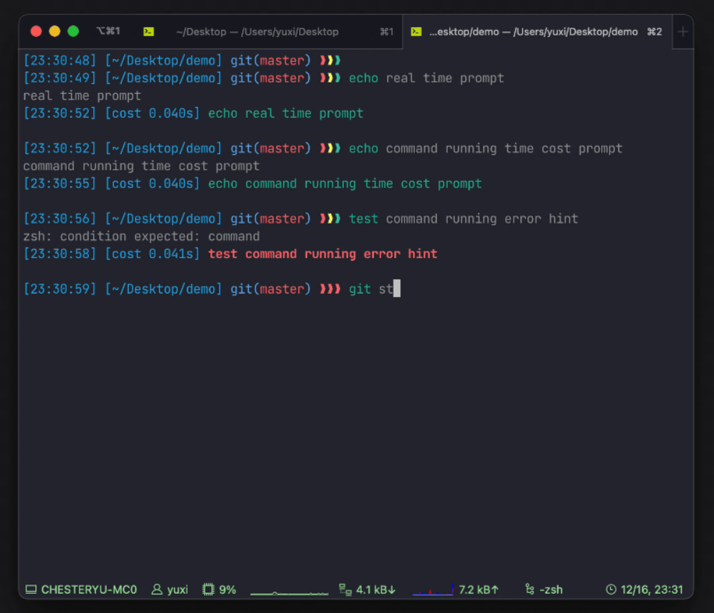

# <center>Ubuntu 22.04.1 LTS</center>

### TODO
- Add terminal design
- Add python script

## 1. Curl
```bash
sudo apt install curl
```

## 2. Pip
```bash
sudo apt install python3-pip
# Necessaery for code
pip3 install mypy
# Recomendation: add to $PATH
PATH=$PATH:$HOME/.local/bin

```

## 3. Heroku
```bash
# Installation
curl https://cli-assets.heroku.com/install.sh | sh
# Checking the installation
heroku --version
```


## 4. Ngrok
```bash
snap install ngrok
```

## 5. Terminal
### 5.1. Zsh
```bash
# Zsh installation
sudo apt install zsh
# Set zsh as default shell
chsh -s $(which zsh) $USER
# Log out/in to see the results
```

### 5.2. OhMyZsh
```bash
sh -c "$(curl -fsSL https://raw.github.com/ohmyzsh/ohmyzsh/master/tools/install.sh)"
```

### 5.3. Add config to .zshrc
```bash
HISTFILE=“$HOME/.zsh_history”
HISTSIZE=10000000
SAVEHIST=10000000
setopt BANG_HIST                 # Treat the ‘!’ character specially during expansion.
setopt EXTENDED_HISTORY          # Write the history file in the “:start:elapsed;command” format.
setopt INC_APPEND_HISTORY        # Write to the history file immediately, not when the shell exits.
setopt SHARE_HISTORY             # Share history between all sessions.
setopt HIST_EXPIRE_DUPS_FIRST    # Expire duplicate entries first when trimming history.
setopt HIST_IGNORE_DUPS          # Don’t record an entry that was just recorded again.
setopt HIST_IGNORE_ALL_DUPS      # Delete old recorded entry if new entry is a duplicate.
setopt HIST_FIND_NO_DUPS         # Do not display a line previously found.
setopt HIST_IGNORE_SPACE         # Don’t record an entry starting with a space.
setopt HIST_SAVE_NO_DUPS         # Don’t write duplicate entries in the history file.
setopt HIST_REDUCE_BLANKS        # Remove superfluous blanks before recording entry.
setopt HIST_VERIFY               # Don’t execute immediately upon history expansion.
setopt HIST_BEEP                 # Beep when accessing nonexistent history.

[ -f ~/.fzf.zsh ] && source ~/.fzf.zsh
export NVM_DIR=“$HOME/.nvm”
[ -s “$NVM_DIR/nvm.sh” ] && \. “$NVM_DIR/nvm.sh”  # This loads nvm
[ -s “$NVM_DIR/bash_completion” ] && \. “$NVM_DIR/bash_completion”  # This loads nvm bash_completion

# Necessary powerlevel10k

ZSH_THEME="powerlevel10k/powerlevel10k"
source ~/powerlevel10k/powerlevel10k.zsh-theme

# To customize prompt, run `p10k configure` or edit ~/.p10k.zsh.
[[ ! -f ~/.p10k.zsh ]] || source ~/.p10k.zsh

echo “Reloaded”

```
### 5.4. fzf
```bash
# fzf installation and key bindings and fuzzy completions
git clone --depth 1 https://github.com/junegunn/fzf.git ~/.fzf
~/.fzf/install
```
### 5.5. Power10k [Repo](https://github.com/romkatv/powerlevel10k#for-new-users)
```bash
git clone --depth=1 https://github.com/romkatv/powerlevel10k.git ~/powerlevel10k
echo 'source ~/powerlevel10k/powerlevel10k.zsh-theme' >>~/.zshrc
```
### 5.6. Another Theme [Repo](https://github.com/ChesterYue/ohmyzsh-theme-passion)



## 6. Docker
### 6.1. Setup repository
```bash
# Uninstall older versions
sudo apt-get remove docker docker-engine docker.io containerd runc
# Update repository
sudo apt-get update
sudo apt-get install \
    ca-certificates \
    curl \
    gnupg \
    lsb-release

# Add Docker’s official GPG key:
sudo mkdir -p /etc/apt/keyrings
curl -fsSL https://download.docker.com/linux/ubuntu/gpg | sudo gpg --dearmor -o /etc/apt/keyrings/docker.gpg
# Settings up the repository
echo \
"deb [arch=$(dpkg --print-architecture) signed-by=/etc/apt/keyrings/docker.gpg] https://download.docker.com/linux/ubuntu \
$(lsb_release -cs) stable" | sudo tee /etc/apt/sources.list.d/docker.list > /dev/null
```
### 6.2. Install Docker engine and Docker compose

Installing docker engine

```bash
# Update package index
sudo apt-get update
# Install latest version
sudo apt-get install docker-ce docker-ce-cli containerd.io docker-compose-plugin
# Test the installation
sudo docker run hello-world
```

Installing docker compose

```bash
# Creating directory
mkdir -p ~/.docker/cli-plugins/
# Downloading docker-compose package
curl -SL https://github.com/docker/compose/releases/download/v2.3.3/docker-compose-linux-x86_64 -o ~/.docker/cli-plugins/docker-compose
# Setting permisions
chmod +x ~/.docker/cli-plugins/docker-compose
# Checking version
docker compose version
```

### 6.2.1. Fixing *Got permission denied while trying to connect*

Run:

```bash
sudo chmod 666 /var/run/docker.sock
```

## 7. NodeJS y NPM

```bash
# Install NodeJS
sudo apt install nodejs
# Install npm
sudo apt install npm
# Checking the installation
nodejs --version
npm --version
```

## 8. Typescript

```bash
# Install npm previously
sudo npm install -g typescript
# Checking installation
tsc
```


# <center>Windows 11</center>

## 1. Python3 & pip3
## 2. Docker
## 3. Terminal
### 3.1. Install WSL2 & Ubuntu
· Install WSL
```bash
wsl --install # Restart the computer after this command
```


· Set WSL to WSL2
· Install Ubuntu through [Microsoft Store](https://www.microsoft.com/store/productId/9PDXGNCFSCZV)
## 4. Ngrok
## 5. Heroku
## 6. NodeJS & npm
## 7. Typescript
